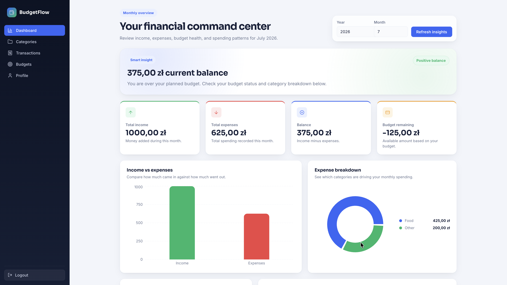
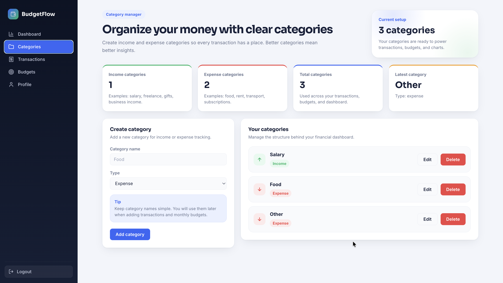
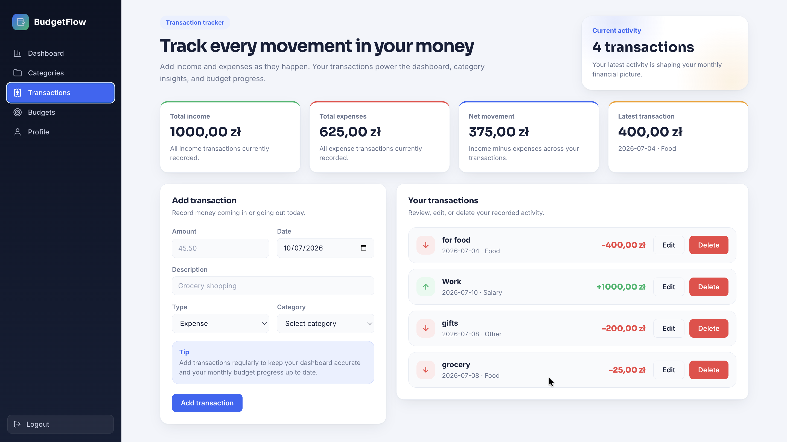
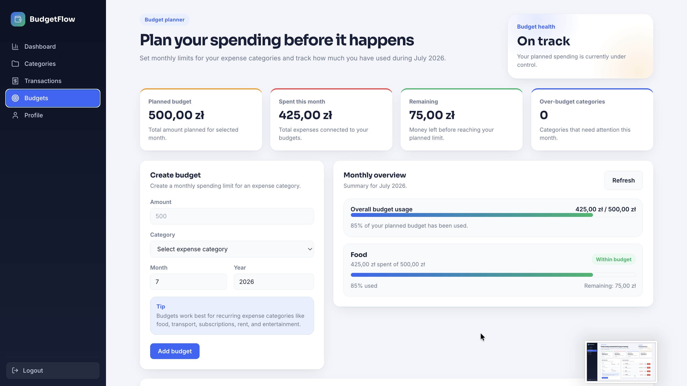
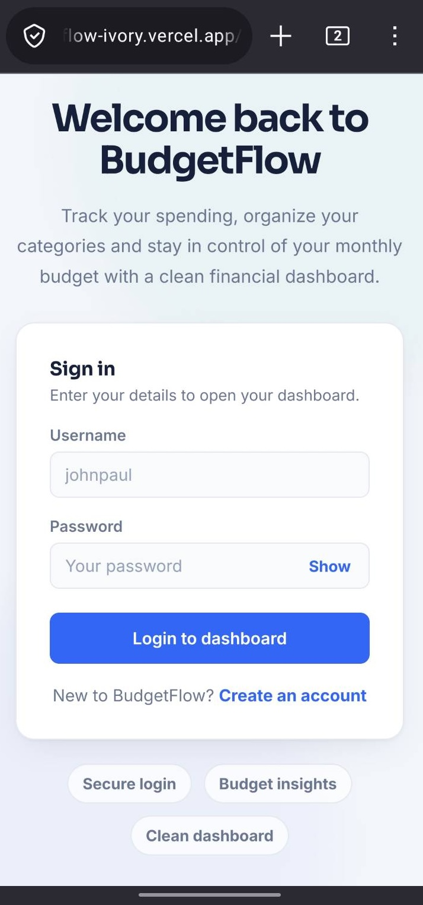

# BudgetFlow

> A full-stack personal finance app with user accounts, JWT authentication, PostgreSQL, budgeting tools, transaction tracking, dashboard analytics, and a responsive React UI.


**[→ Open live demo](https://budget-flow-ivory.vercel.app)**  
**[→ API documentation](https://budgetflow-wni6.onrender.com/docs)**

*(Frontend hosted on Vercel. Backend hosted on Render’s free tier. First request after inactivity may take up to a minute while the server wakes up.)*

---

## Screenshots

### Dashboard



### Categories



### Transactions



### Budgets



### Mobile View

<p align="center">
  
</p>

---

## Features

- JWT authentication with protected routes
- User profile page and password change
- Income and expense categories
- Transaction tracking with date, type, category, and description
- Monthly budgets by category
- Dashboard with monthly financial insights
- Income vs. expenses chart
- Expense breakdown chart
- Budget progress tracking
- Mobile responsive layout
- Dockerized backend
- PostgreSQL database with Alembic migrations
- Backend test suite with Pytest

---

## Tech Stack

| Layer | Tools |
|---|---|
| Frontend | React, Vite, React Router, Axios, Recharts |
| Backend | FastAPI, SQLAlchemy, Alembic, JWT, Pytest |
| Database | PostgreSQL, Neon |
| Infra | Docker, Vercel, Render |

---

## Quick Start

### Clone

```bash
git clone https://github.com/YMoso/BudgetFlow.git
cd BudgetFlow
```

### Backend

```bash
python -m venv venv
source venv/bin/activate      # Windows: venv\Scripts\activate

pip install -r backend/requirements.txt
```

Create a `.env` file in the project root:

```env
SECRET_KEY=change-this-secret-key
ALGORITHM=HS256
DATABASE_URL=sqlite:///./budgetflow.db
FRONTEND_URL=http://localhost:5173
```

Run migrations and start the server:

```bash
alembic upgrade head
uvicorn backend.app.main:app --reload
```

Backend: `http://localhost:8000`  
API docs: `http://localhost:8000/docs`

### Frontend

```bash
cd frontend
npm install
```

Create `frontend/.env`:

```env
VITE_API_URL=http://localhost:8000
```

Start the frontend:

```bash
npm run dev
```

Frontend: `http://localhost:5173`

### Docker

Run the backend and PostgreSQL with Docker:

```bash
docker compose up --build
```

Useful Docker commands:

```bash
docker compose down       # stop containers
docker compose down -v    # stop containers and reset database volume
```

---

## Environment Variables

### Backend

| Variable | Description |
|---|---|
| `SECRET_KEY` | Secret key used for JWT signing |
| `ALGORITHM` | JWT algorithm, for example `HS256` |
| `DATABASE_URL` | Database connection string |
| `FRONTEND_URL` | Allowed frontend origin for CORS |

Example:

```env
SECRET_KEY=change-this-secret-key
ALGORITHM=HS256
DATABASE_URL=sqlite:///./budgetflow.db
FRONTEND_URL=http://localhost:5173
```

### Frontend

| Variable | Description |
|---|---|
| `VITE_API_URL` | Backend API base URL |

Example:

```env
VITE_API_URL=http://localhost:8000
```

---

## Tests

The backend includes automated tests with Pytest.

Run tests:

```bash
pytest -v
```

The test suite covers:

- User registration and login
- Protected authentication flow
- Category creation, editing, deletion, and user scoping
- Transaction creation, editing, deletion, and validation
- Budget creation, editing, deletion, and monthly summary logic
- Dashboard monthly summary calculations

---

## Quality Checks

### Frontend

```bash
cd frontend
npm run lint
npm run build
```

### Backend

```bash
pytest -v
```

These checks help verify that the frontend builds correctly and the backend API logic works as expected.

---

## API Overview

```text
/auth          register, login
/user          profile, change password
/categories    CRUD
/transactions  CRUD
/budgets       CRUD
/dashboard     monthly summary
```

Example endpoints:

```text
POST   /auth/register
POST   /auth/token

GET    /user/
PUT    /user/change-password

GET    /categories/
POST   /categories/
PUT    /categories/{category_id}
DELETE /categories/{category_id}

GET    /transactions/
POST   /transactions/
PUT    /transactions/{transaction_id}
DELETE /transactions/{transaction_id}

GET    /budgets/
POST   /budgets/
PUT    /budgets/{budget_id}
DELETE /budgets/{budget_id}

GET    /dashboard/monthly
```

Full interactive docs: [budgetflow-wni6.onrender.com/docs](https://budgetflow-wni6.onrender.com/docs)

---

## Project Structure

```text
BudgetFlow/
├── backend/
│   └── app/
│       ├── routers/
│       │   ├── auth.py
│       │   ├── user.py
│       │   ├── categories.py
│       │   ├── transactions.py
│       │   ├── budgets.py
│       │   └── dashboard.py
│       ├── database.py
│       ├── models.py
│       └── main.py
├── frontend/
│   └── src/
│       ├── api/
│       ├── context/
│       ├── pages/
│       ├── styles/
│       └── App.jsx
├── alembic/
├── tests/
├── Dockerfile
└── docker-compose.yml
```

---

## Deployment

BudgetFlow is deployed as three separate services:

| Part | Platform |
|---|---|
| Frontend | Vercel |
| Backend | Render |
| Database | Neon PostgreSQL |

### Production environment

Frontend:

```env
VITE_API_URL=https://budgetflow-wni6.onrender.com
```

Backend:

```env
SECRET_KEY=your-secret-key
ALGORITHM=HS256
DATABASE_URL=your-neon-postgresql-url
FRONTEND_URL=https://budget-flow-ivory.vercel.app
```

The backend is deployed with Docker and runs Alembic migrations before starting the FastAPI server.

---

## Roadmap

- [ ] User-selectable currency
- [ ] Recurring transactions
- [ ] CSV export
- [ ] Advanced filters and pagination
- [ ] Email verification and password reset
- [ ] Admin dashboard

---

## Author

**Yuriy Mosorov** — [GitHub](https://github.com/YMoso)